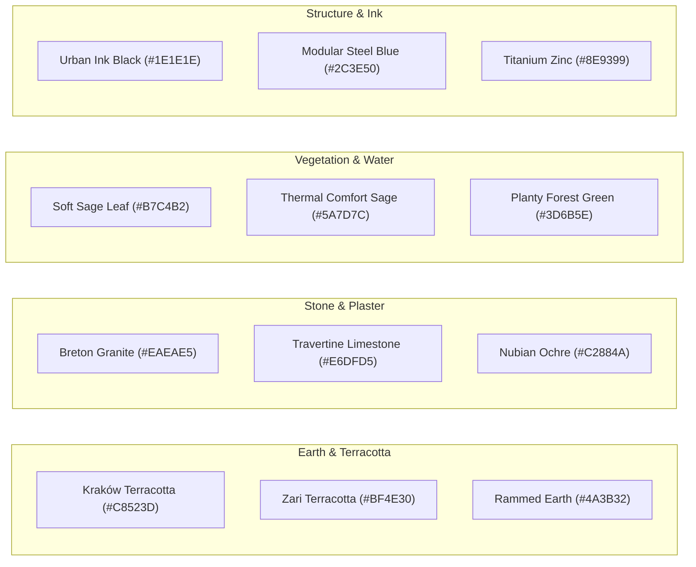
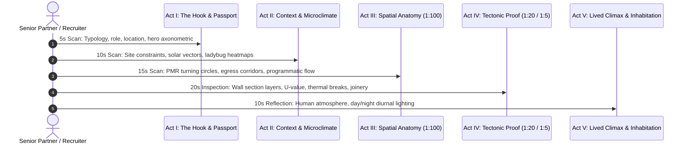

# Visual Communication & Architectural Design Synthesis: Empirical Lessons Across 20+ Portfolios

> **Author:** Sara Bensalem Studio & Antigravity Coding Agents  
> **Source Corpus:** `g:\My Drive\Portfolios` (20+ Premier International Spatial Portfolios)  
> **Target Framework:** Publication-Grade Architectural Visual Communication, Monograph Compilers & Agentic Detailing Skills  

---

## 1. Executive Overview

An exhaustive comparative analysis of more than 20 architectural, urban, interior, and landscape portfolio case studies reveals that high-converting portfolios do not succeed through visual ornamentation or photorealistic 3D render volume. They succeed because they operate as **high-stakes trust interfaces** governed by strict visual communication principles:

1. **Typographic Discipline**: Maximum of two font families (one geometric/grotesk display and one neutral sans-serif body), anchored by a monospace technical tier for dimensions, scales, and metadata.
2. **Modular Grid Rigor**: Strict adherence to 8, 12, or 16-column grids with synchronized baseline rhythms, preventing visual vibration and establishing architectural order.
3. **Restrained, Material-Grounded Color Harmony**: Palettes derived directly from physical construction materials (granite, terracotta, lime-hemp, weathered steel, oak, sandstone) rather than digital RGB neon gradients.
4. **Multi-Scalar Drawing Integration**: The simultaneous co-presence of Macro (1:500 context), Meso (1:100 spatial anatomy), and Micro (1:20 / 1:5 tectonic assembly) drawings on single spreads to prove buildability.
5. **Narrative Pacing & Sequential Framing**: Deploying the 5-Act spatial narrative arc and graphic novel sequential framing to guide the reviewer through experiential, psychological, and technical reality.
6. **Negative Space Breathing Room**: Allocating 40% to 50% of the spread area to clean negative space, allowing complex drawings to breathe and respecting the 15-to-30-second cognitive scan path of hiring partners.

---

## 2. Typographic Hierarchy & Pairing Systems

Across top-tier portfolios (Palak Bhattad, Anu Kottummel Joy, Salma Sameh, Thibault Chrétien, Alif Ahammed), typography functions as structural framing.

```
DISPLAY LEVEL (Project Titles, Act Markers, Chapter Numbers)
  ├── Space Grotesk (700 Bold) / Neue Haas Grotesk / League Spartan
  ├── Size: 24pt - 36pt (Digital Spread) // Tracking: -0.02em to -0.04em (Tight)
  └── Purpose: Instant visual anchor within first 1.5 seconds of scan path.

NARRATIVE BODY LEVEL (Problem Statements, Spatial Concepts, Methodology)
  ├── Inter / Plus Jakarta Sans (400 Regular, 500 Medium)
  ├── Size: 10pt - 11pt // Leading: 1.45 - 1.55 // Line length: 45 - 65 characters
  └── Purpose: High legibility at arm's length or on 14" laptop screens; zero "wall of text".

TECHNICAL METADATA & COTATION LEVEL (Scales, Dimensions, Schedules, Lat/Long)
  ├── JetBrains Mono / Space Mono / IBM Plex Mono (500-700 SemiBold/Bold)
  ├── Size: 9pt - 11pt // Tracking: +0.04em to +0.08em (Open for micro-legibility)
  └── Purpose: Unmistakable technical authority; communicates CAD/BIM precision.
```

### Typographic Golden Rules:
- **Never use more than 3 type sizes per spread**: e.g., 24pt Display Title, 11pt Narrative Body, 9pt Technical Monospace.
- **Folio Numbering as Architectural Monument**: Following Thibault Chrétien and Alif Ahammed, huge 20% opacity chapter/act numbers (`01`–`06`) act as subtle structural mass rather than distracting decoration.
- **Zero Decorative Scripts or Low-Contrast Gray**: Text contrast ratio must exceed 7:1 against paper ground to ensure readability on dimmed review tablets.

---

## 3. Modular Grid Systems & Proportional Formats

The portfolio corpus demonstrates four distinct aspect ratios, each tailored to specific spatial scales:

| Format & Aspect Ratio | Typical Spread Dimensions | Column System | Ideal Typology & Benchmark |
| :--- | :---: | :---: | :--- |
| **2:1 Panoramic Double-Square** | 1190 x 595 mm | **12 Columns** (w/ 50% left breathing zone) | Urban morphology, street transects, riverfronts (*Palak Bhattad CEPT*) |
| **16:9 Cinematic Widescreen** | 1920 x 1080 px | **12 or 16 Columns** (16px gutters) | Commercial masterplans, transit hubs, mixed-use (*Yassin Saber, Sara Bensalem*) |
| **Square 1:1 Editorial Monograph** | 210 x 210 mm / 1200 x 1200 px | **9 Columns** (Tripartite matrix) | Vernacular earth, monograph publishing (*Alif Ahammed, Pearl Gupta*) |
| **A4 Landscape / Double-A4** | 297 x 210 mm / 420 x 297 mm | **8 Columns** (Topographical margins) | Landscape ecology, alpine bivouacs, memorials (*Anu Kottummel, Neha George*) |

### The 50% Left Text Breathing Zone (The CEPT Rule):
In Palak Bhattad's urban analysis, text is strictly cordoned off within the first 6 columns of a 12-column spread. The remaining 6 columns are dedicated exclusively to uncropped isometric drawings and axonometrics. This eliminates the common amateur error of wrapping text awkwardly around drawing bounding boxes.

---

## 4. Empirical Materiality & Color Palettes

Elite portfolios reject arbitrary saturated UI color schemes in favor of palettes rooted in building geology, ecology, and climate:



### Color Contrast Architecture:
- **Spread Canvas**: Never `#000000` (causes severe eye fatigue) and rarely pure `#FFFFFF`. Top monographs use warm archival bone (`#F8F8F5`), chalk paper (`#FAFAF8`), or linen greige (`#F4F1EA`).
- **Cut Lines & Primary Poché**: Deep graphite charcoal (`#111110` or `#1E1E1E`) delivers razor-sharp linework without harsh aliasing.
- **Functional Accent Color (The 10% Rule)**: Exactly ONE accent color per project (e.g., Crimson `#8B263E` for trauma sanctuaries, Polycarbonate Cyan `#4A90E2` for tropical flood infrastructure, Zari Terracotta `#BF4E30` for craft bazaars).

---

## 5. Multi-Scalar Drawing Integration (The Trust Trifecta)

The fatal flaw of 90% of architectural portfolios is the **Scalar Disconnect**: showing an aerial rendering and then jumping directly to a detached perspective without explaining how the parts assemble.

High-scoring portfolios (Salma Sameh, David Romaldo, Raneem Ahmed) employ the **Trust Trifecta** across project spreads:

```
[MACRO LEVEL: 1:500 - 1:200]
  ├── Site Plan, Topographical Hydrology, Urban Transect, Solar Azimuth Vector
  └── Answers: "Where is this project? How does it anchor to geography and climate?"

[MESO LEVEL: 1:100 - 1:50]
  ├── Floor Plans, Long Section, Circulation Spine, 1500mm PMR Turning Circles
  └── Answers: "How do humans navigate this volume? Is it legally accessible and egress-compliant?"

[MICRO LEVEL: 1:20 - 1:5]
  ├── Constructive Wall Section, Waterproofing Membrane, Thermal Break, Joinery Reveal
  └── Answers: "Can this person build this? Do they know how materials join, weather, and insulate?"
```

---

## 6. Narrative Pacing & The 5-Act Portfolio Structure

A 3-to-4 spread project narrative must move the reviewer through an intentional dramatic arc:



---

## 7. Next-Generation Enhancements for Design Skills

Based on this synthesis, our design agent skills must be upgraded with:
1. **Dynamic Multi-Look Monograph Generator**: Support for 19 distinct empirical looks (including CEPT Urban Morphology, Tropical Resilience, Landscape Ecology, Speculative Critical, Trauma Commons, Ladybug Environmental Simulation, Commercial Courtyards).
2. **Expanded 1:20 Wall Section Assemblies**: New thermal assemblies (tropical timber pin, terracotta cavity, Nubian sandstone, alpine monocoque, commercial curtain wall) with accurate Glaser U-values.
3. **Comprehensive PMR & Egress Plan Validator**: Multi-zone 1500mm turning circles, 900mm door arcs, corridor clearances, and travel distance calculations.
4. **Multi-Climate Bioclimatic Calculator**: Latitude-based solar noon altitudes, stack ventilation velocities, optimal overhang depths ($D = H / \tan\theta$), and diurnal thermal damping lag.
5. **1:5 Joinery Detailer with Hardware Tolerances**: Concealed Blum/Hettich pockets, negative shadow reveals (joint creux), and stainless pin connections.
6. **Grill My Design Visual Hierarchy Probe**: Evaluating font family counts, grid alignment, multi-scalar coherence, and negative space ratios.
