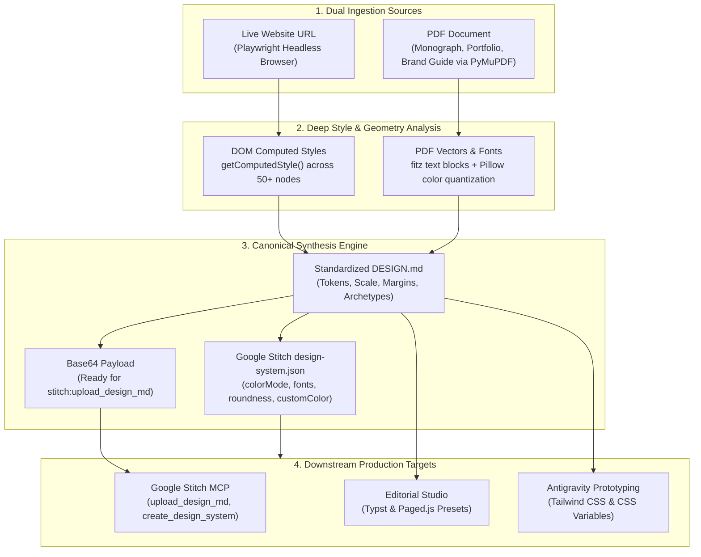

# Design MD Extractor (`/extract-design-web` & `/extract-design-pdf`)
### *Automated Visual Grammar & Design Token Ingestion from Websites and PDFs*

`design-md-extractor` enables AI agents to inspect any live website or PDF document and automatically extract its visual DNA—color palettes, typographic hierarchies, spatial grids, corner radii, elevation shadows, and component archetypes—into a canonical **`DESIGN.md`** and Google Stitch-ready design system.

---

## ⚡ Core Capabilities & Dual-Engine Architecture



---

## 🌐 Engine 1: Web Browser Extraction (`extract_from_web.py`)

Navigates to any URL using Playwright Chromium to compute real, rendered styles:
- **Color Grammar**: Computes body/canvas backgrounds, card surfaces, primary text, muted text, border strokes, and button accent colors. Automatically determines Light vs Dark mode and WCAG contrast.
- **Typography Scale**: Evaluates `h1` through `h4`, body paragraphs, and navigation links for exact font families, font weights (`400`, `600`, `700`), font sizes (`px`), line heights, and letter spacing. Automatically maps font names to Google Stitch supported fonts (`INTER`, `MONTSERRAT`, `SPACE_GROTESK`, `GEIST`, `PLAYFAIR_DISPLAY`, etc.).
- **Shape & Elevation**: Detects corner roundness (`0px`, `4px`, `8px`, `12px`, `full`), box shadows, and glassmorphic `backdrop-filter` blur.
- **Layout & Margins**: Detects container max-widths (`1280px`, `1440px`), flex/grid structures, and padding scales.

### CLI Usage:
```bash
python C:\Users\sounn\.gemini\config\skills\design-md-extractor\scripts\extract_from_web.py "https://linear.app" --output-dir ./linear_design
```

---

## 📄 Engine 2: PDF Monograph & Portfolio Extraction (`extract_from_pdf.py`)

Inspects any architectural portfolio, monograph, lookbook, or corporate brand PDF:
- **Sheet Geometry & Format**: Extracts trim dimensions (e.g. A3 Landscape `1190.6pt x 841.9pt`, A4 Portrait `595.3pt x 841.9pt`, 16:9 Widescreen), aspect ratio, and facing-spread layout.
- **Embedded Fonts**: Extracts embedded PostScript / TrueType font names (e.g. `CenturyGothic`, `Neue Haas Grotesk`, `Garamond`, `Futura`), font size frequency distributions, and leading intervals.
- **Color Extraction**: Samples vector shape fills/strokes (`page.get_drawings()`) and extracts dominant raster color palettes using Pillow median-cut quantization.
- **Grid & Margins**: Computes inner spine margins, top margins, column grid counts (12-column Swiss or multi-column), and baseline grid intervals (`4pt`/`8pt`).
- **ISO 128 Lineweights**: Integrates CAD lineweight hierarchies (`0.13mm` hairline to `0.70mm` cut).

### CLI Usage:
```bash
python C:\Users\sounn\.gemini\config\skills\design-md-extractor\scripts\extract_from_pdf.py "g:\My Drive\Portfolios\Jill_Mehta_Undergraduate_Portfolio_2021_2026.pdf" --output-dir ./jill_design --max-pages 5
```

---

## 🌉 Google Stitch MCP Integration Bridge

The extractor automatically produces the base64-encoded UTF-8 payload required by Google Stitch:

1. **Upload `DESIGN.md` to Project**:
   ```json
   // Call MCP Tool: stitch:upload_design_md
   {
     "projectId": "YOUR_PROJECT_ID",
     "designMdBase64": "<BASE64_STRING_FROM_design_md_base64.txt>"
   }
   ```
2. **Generate Stitch Design System**:
   ```json
   // Call MCP Tool: stitch:create_design_system_from_design_md
   {
     "projectId": "YOUR_PROJECT_ID",
     "selectedScreenInstance": {
       "id": "SCREEN_INSTANCE_ID",
       "sourceScreen": "projects/YOUR_PROJECT_ID/screens/SCREEN_ID"
     }
   }
   ```
3. **Alternative Direct API Creation**:
   ```json
   // Call MCP Tool: stitch:create_design_system
   {
     "projectId": "YOUR_PROJECT_ID",
     "designSystem": {
       "displayName": "Extracted Monograph Design System",
       "theme": {
         "colorMode": "LIGHT",
         "customColor": "#9A1A1D",
         "colorVariant": "NEUTRAL",
         "headlineFont": "CENTURY_GOTHIC",
         "bodyFont": "CENTURY_GOTHIC",
         "roundness": "ROUND_FOUR",
         "designMd": "<RAW_MARKDOWN_CONTENT>"
       }
     }
   }
   ```

---

## 📋 File Layout

```
C:\Users\sounn\.gemini\config\skills\design-md-extractor\
├── SKILL.md                          # Master skill documentation
├── manifest.json                     # Skill registration manifest
├── templates/
│   └── DESIGN-schema.md              # Canonical DESIGN.md template
└── scripts/
    ├── extract_from_web.py           # Playwright headless browser crawler
    ├── extract_from_pdf.py           # PyMuPDF + Pillow PDF inspector
    └── stitch_bridge.py              # Stitch MCP base64 payload generator
```
