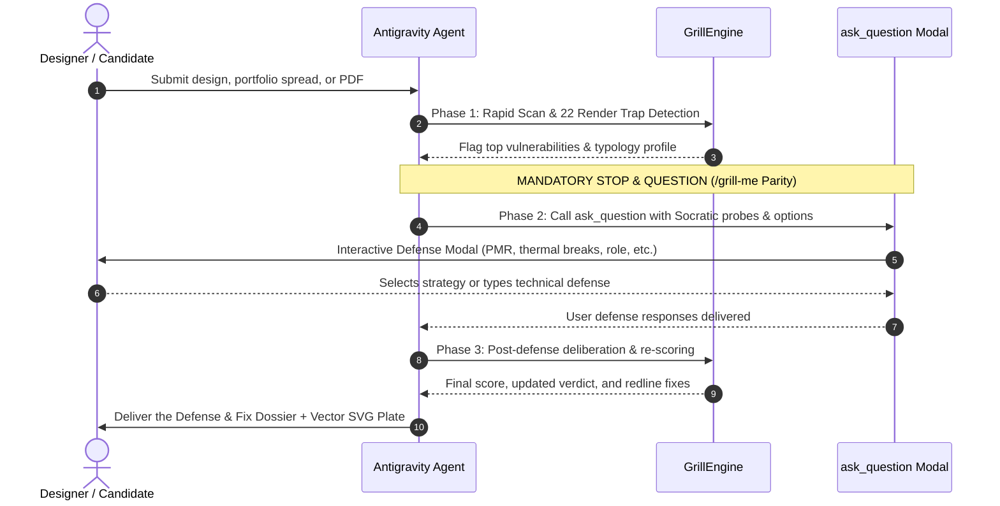

# Grill My Design (`/grill-my-design`)
### *The Interactive Socratic Architectural Design Review & Portfolio Cross-Examiner*
**Sara Bensalem Studio • Strasbourg Atelier [48°35'05"N 07°45'02"E]**

`grill-my-design` is an unforgiving, interactive Socratic design review tribunal. It simulates high-stakes architectural crits (Harvard GSD, AA London, ETH Zürich, ENSA Strasbourg) and partner-level hiring reviews (Foster + Partners, BIG, Herzog & de Meuron, Gensler).

Unlike passive critique tools that dump static monologues, **`grill-my-design` actively halts execution and interrogates the user using the `ask_question` tool**, forcing the designer to defend their detailing, code egress, and spatial logic before issuing a final verdict.

---

## ⚡ The 3-Phase Socratic Interrogation Protocol

Whenever `/grill-my-design` is invoked (or when an architectural project, portfolio spread, or drawing is submitted for critique), the agent **MUST** follow this 3-phase execution cycle:



---

## 🔍 The 22 Lethal Render Traps Engine

`grill-my-design` automatically scans submissions for the **22 Lethal Render Traps** that destroy architectural credibility:

| Trap # | Lethal Render Antipattern | Physical Failure Mechanism | The Tectonic Rescue |
| :---: | :--- | :--- | :--- |
| **#1** | **The Floating Glass Box** | Solar greenhouse overheating (>45°C), thermal shock cracking. | Recess head/sill frames; triple Low-E glazing; exterior louvers (SHGC <= 0.22). |
| **#2** | **The Magic Cantilever Stair** | Treads shear plaster wall on day 1; violates 1.5 kN/m guard code. | Conceal a 250x100x8mm steel box stringer in wall; solid oak sleeves over steel tubes. |
| **#3** | **The Zero-Reveal Millwork** | Hygroscopic wood expansion (2–3mm/m) causes doors to jam. | Detail a deliberate 3mm black shadow line reveal around all perimeter cabinet edges. |
| **#4** | **The Cantilevered Stone Slab** | Natural stone has near-zero tensile strength (4–6 MPa); snaps. | Build internal welded RHS steel chassis; clad in lightweight aluminum honeycomb panels. |
| **#5** | **The Uninsulated Rammed-Earth Wall** | Capillary groundwater suction wicks 1.2m up; base collapse. | Elevate earth wall 300mm on concrete plinth; dual EPDM damp-proof courses. |
| **#6** | **The Frameless Timber-on-Water Deck**| Capillary rot and fungal decay disintegrate timber in 18 months. | Helical screw piles; elevate posts +300mm above 100-yr flood level; EPDM breaks. |
| **#7** | **The Sharp 90° High-Rise Tower** | Dynamic cross-wind vortex shedding shears curtain wall gaskets. | Chamfer corners with 15% radius; wind relief slots; +/-25mm drift bellows. |
| **#8** | **The Unanchored Ceiling Duct** | Mechanical vibrations transmit through rigid timber walls (NC > 40). | 2400mm inline silencer splitters; 50mm Sylomer elastomeric acoustic collars. |
| **#9** | **The Full-Height Jamming Pocket Door**| Ceiling slab sag (10–12mm) crushes carriage; unsealed pocket leaks sound.| Extruded aluminum deflection head channels allowing 15mm sag; Athmer Schall-Ex drop seals. |
| **#10**| **The Red/Green Cockpit / Dashboard** | Colorblind users (8% of men) cannot see emergency alerts. | Enforce redundant visual encoding: color + geometric glyphs + text + audio. |
| **#11**| **The Grey-on-Grey / Beige UI** | Contrast ratio <2:1 violates WCAG AAA, creating eye strain. | Mandate minimum 7:1 contrast ratio using dark titanium tokens (#0B0F17 / #F1F5F9). |
| **#12**| **The 100-Page Student Dump** | Cognitive fatigue causes reviewers to abandon portfolio in 45s. | Curate down to 5 flagship projects using the 5-Act Narrative; archive the rest. |
| **#13**| **The Placeholder Latin Leak** | Leaving `Lorem ipsum` signals zero quality control. | Replace with authored 3-line Curatorial Statement defining structural load paths. |
| **#14**| **The Poster Screenshot Infill Hack** | Pasting vertical A1 boards into horizontal 16:9 produces 3.5pt text.| Dissect raw vectors; re-layout across 12-column Swiss grid across 4 spreads. |
| **#15**| **The Fake CAD Section Trap** | Labeling flat 2D elevations as sections with zero slab depth. | Cut true building sections showing 250mm concrete slab, screed to fall, plenum. |
| **#16**| **The Impossible Spatial Math Error** | Gross dimensional blunders (e.g. 3.1 m² bedroom suite). | Calculate exact GIA/NIA; verify clearances against PMR 1500mm turning circles. |
| **#17**| **The Wasted Manufacturer Credential** | Listing Knauf or Schöck training on CV but showing zero details. | Add dedicated 1:20 working detail plates citing exact manufacturer system codes. |
| **#18**| **The Flattened Raster Print Trap** | Flattening vector drawings into heavy raster destroys lineweights. | Export scalable vector graphics (PDF/SVG) with ISO 128 lineweights (0.50mm cut). |
| **#19**| **The Metadata Copy-Paste Leak** | Copy-pasting metadata (e.g. 3-storey villa claiming 18,000 m²). | Bind each project passport to its verified architectural program. |
| **#20**| **The Default Consumer PDF Metadata Trap**| Leaving Canva, iLovePDF stamps and default export titles. | Sanitize PDF metadata with Ghostscript; inject professional author tags. |
| **#21**| **The 3D Book Mockup Letterbox Trap** | Embedding spreads in 3D open book renders wastes 35% canvas. | Export true 1:1 vector spreads with full bleed, maximizing display canvas. |
| **#22**| **Cover-to-Spread Aspect Ratio Mismatch**| Vertical cover with horizontal spreads causes PDF viewer jumps. | Unify the entire document on a consistent 16:9 widescreen landscape geometry. |

---

## 🏛️ Context-Aware Architectural Typologies

The engine automatically detects the project typology and adapts its critical checkpoints:

1. **`RESIDENTIAL_VILLA`**: Prioritizes hygrothermal moisture plinth (+150mm), window reveal detailing, private/public acoustic thresholds (DnTw >= 53 dB), and ground-floor universal PMR access.
2. **`HIGH_RISE_COMMERCIAL`**: Prioritizes cross-wind vortex shedding mitigation (corner chamfers, wind-relief slots), core Net-to-Gross efficiency (>= 75%), dual pressurized fire stairs (<45m egress), and curtain wall drift bellows (+/-25mm).
3. **`CULTURAL_MUSEUM`**: Prioritizes luminance lux decompression choreography (max delta log10 lux < 1.8), gallery acoustic dampening (RT60 <= 0.85s), daylight autonomy without UV damage (<50 lux), and universal PMR promenade ramps (1:12 slope).
4. **`ADAPTIVE_REUSE`**: Prioritizes historic masonry hygrothermal breathability (lime-hemp, no cementitious barriers), Glaser condensation prevention, reversible structural flitch plates, and decoupled timber frames.
5. **`MASS_TIMBER`**: Prioritizes CLT end-grain moisture protection, acoustic impact isolation (Sylomer resilient mounts), fire char layer calculations (60–90 min), and concealed steel knife plate connections.
6. **`RIPARIAN_WATERFRONT`**: Prioritizes helical screw piles, finished floor elevation +450mm above 100-year flood splash line, continuous EPDM capillary breaks, and marine 316 A4 stainless hardware.
7. **`URBAN_MASTERPLAN`**: Prioritizes transit morphology, declared Floor Area Ratio (FAR) and ground coverage math, 5-minute pedestrian catchment isochrones (400m radius), and urban microclimate wind corridors.

---

## ⚡ The 3-Round Socratic Defense Protocol (`ask_question`)

When interrogating a submission, the tribunal organizes questions into focused defense rounds:

### Round 1: Constructive Integrity & Code Egress
- Focus: Continuous thermal breaks, structural load paths, slab thickness, and universal PMR 1500mm turning circles.
- Mandatory Stop: Call `ask_question` with 2–3 targeted probes.

### Round 2: Thermodynamics, Climate & Phenomenological Comfort
- Focus: Solar Heat Gain Coefficient (SHGC), natural stack ventilation, acoustic dampening, and luminance gradients.

### Round 3: Recruiter Trust, Swiss Grid & Attributed Craft
- Focus: Project Passport metadata, individual line-item contribution, 12-column Swiss grid discipline, and zero Latin placeholders.

#### Example `ask_question` Call Schema (`/grill-me` Parity):
```json
{
  "questions": [
    {
      "question": "[Environmental] [TRAP #1] You specified expansive floor-to-ceiling glazing with no exterior louvers. What is your calculated Solar Heat Gain Coefficient (SHGC), and how do you prevent severe summer greenhouse overheating?",
      "options": [
        "(Recommended) We specified triple glazing with Low-E soft coatings (SHGC <= 0.22) and integrated motorized external venetian louvers.",
        "The facade incorporates automated exterior solar fins calibrated to the local 48° summer solar azimuth.",
        "We recessed the glazing 600mm beneath deep architectural overhangs to provide complete passive summer shading.",
        "Solar gain was accepted as a passive heating strategy and tempered by active chilled ceiling beams."
      ],
      "is_multi_select": false
    },
    {
      "question": "[Constructive Lead] Where is your continuous thermal break at the cantilevered concrete terrace slab to prevent interior condensation and mold?",
      "options": [
        "(Recommended) We specified a structural thermal break module (Schöck Isokorb) with 80mm EPS core at the slab junction.",
        "The exterior envelope is fully wrapped with 120mm continuous mineral wool outside the concrete structure.",
        "We designed a thermally decoupled self-supporting exterior steel chassis with pin connections.",
        "This was an early conceptual competition scheme where tectonic detailing was deferred to Stage 3."
      ],
      "is_multi_select": false
    },
    {
      "question": "[Spatial Chair] Show me your universal accessibility clearances. Can a wheelchair user complete a 1500mm turning maneuver in your entrance vestibule and primary WC?",
      "options": [
        "(Recommended) All entrance vestibules and primary sanitary facilities maintain verified 1500mm turning diameter circles.",
        "Door openings are minimum 930mm clear width with zero-threshold flush sills.",
        "Accessible routes are integrated into the main public sequence rather than segregated.",
        "PMR clearances were not explicitly drafted on this schematic plan."
      ],
      "is_multi_select": false
    }
  ]
}
```

---

## 🎨 Visual Redline Stamp & Crit Sheet SVG Generator

`grill-my-design` generates a publication-grade **16:9 vector SVG Socratic Crit Sheet** (1920x1080):
- **Strasbourg Atelier Tribunal Seal**: Official stamped circular seal (`PASSED TRIBUNAL // STRONG HIRE` in `#1B4332`, `CONDITIONAL` in `#92400E`, `RENDER TRAP ALERT` in `#991B1B`).
- **5-Dimension Radar & Score Progression HUD**: Displays Pre-Defense vs Post-Defense scores and dimension bar gauges.
- **Itemized Redline Callouts**: Highlights detected defects with calibrated lineweights (0.50mm cut, 0.25mm boundary, 0.13mm hairline).
- **Tectonic Rescue Package**: Prescribes exact 1-click terminal commands to automatically generate missing drawings.

---

## 💻 CLI Execution Commands

Run the tribunal from PowerShell / bash:

```bash
# Rapid diagnostic scan with SVG crit sheet generation
python -m engine.cli --text "Residential villa in Strasbourg with glass box facade" --svg crit_sheet.svg

# Output JSON payload formatted for the ask_question tool (/grill-me parity)
python -m engine.cli --text "High-rise tower with sharp 90-degree corners" --ask-questions --round 1

# Interactive terminal cross-examination loop
python -m engine.cli --text "Museum with stone cantilever slab" --interactive

# Full programmatic JSON report export
python -m engine.cli --text "Waterfront boardwalk over lake" --json
```
