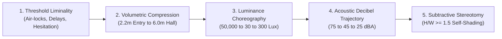
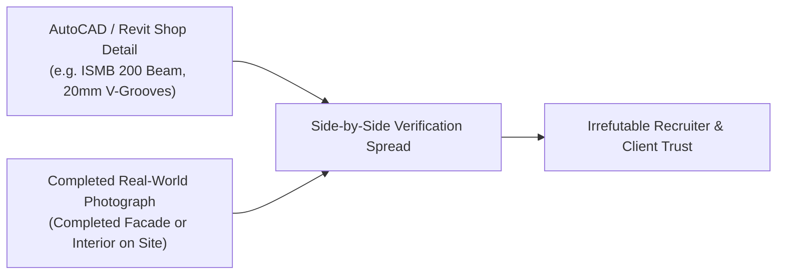
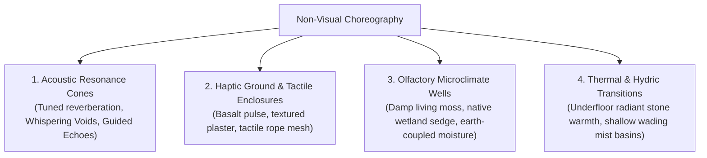

# Spatial Choreography (`/spatial-choreography`)
### *Phenomenological Spatial Journeys, Sensory Thresholds & Subtractive Courtyard Stereotomy*
**Sara Bensalem Studio • Strasbourg Atelier [48°35'05"N 07°45'02"E]**

> *"Architecture is not a static object or an arrangement of neutral rectangular boxes. Architecture is experienced through time and motion—a choreographed sequence of sensory thresholds where light, shadow, acoustics, volume, and material texture evoke emotional gravity and human resonance."*

`spatial-choreography` equips architectural and interior design agents with the principles of **phenomenological spatial sequencing**, translating sterile room programs into evocative experiential narratives grounded in environmental physics.

---

## 🏛️ The 5 Pillars of Phenomenological Spatial Design



---

## 1. The Phenomenological Spatial Trajectory

Sterile plans organize rooms by utilitarian labels ("Room 101", "Gallery 2", "Corridor B"). In contrast, **elite spatial design structures space as a sequential emotional journey**:

| Journey Phase | Psychological State | Spatial Archetype | Target Luminance | Ambient Sound Level | Volumetric Scale |
| :--- | :--- | :--- | :---: | :---: | :---: |
| **01. Arrival / Threshold** | Transition & Disconnect | Deep portico, double-curtain airlock, "Space for Hesitation" | $150\text{–}300\text{ lux}$ | $60\text{–}65\text{ dBA}$ | Compressed ($H \le 2.4\text{ m}$) |
| **02. Subterranean Descent** | Gravity & Introspection | Stepped ramp, monolithic battered walls, earth-coupled datum | $50\text{–}80\text{ lux}$ | $45\text{–}50\text{ dBA}$ | Constricted ($W \le 1.8\text{ m}$) |
| **03. Deep Contemplation** | Stillness & Vulnerability | Sunken court, cloistered water reflection pool, heavy mass | $20\text{–}40\text{ lux}$ | $25\text{–}30\text{ dBA}$ | Tall & Narrow ($H/W \ge 2.0$) |
| **04. Zenithal Epiphany** | Elevation & Awakening | Punctured overhead oculus, raking slit window, light shaft | $300\text{–}800\text{ lux}$ (beam) | $35\text{–}40\text{ dBA}$ | Soaring ($H \ge 5.5\text{ m}$) |
| **05. Lived Resolution** | Belonging & Grounding | Communal hearth, tactile timber bench, framed landscape vista | $200\text{–}400\text{ lux}$ (warm) | $45\text{–}50\text{ dBA}$ | Human Scale ($H \approx 3.0\text{ m}$) |

---

## 2. Luminance Lux Choreography (Photometric Gradients)

The human eye adapts logarithmically to changes in brightness. Abrupt transitions cause blinding glare or dark disorientation. Choreograph daylight and artificial light across calibrated thresholds:

$$\Delta E = \log_{10}\left(\frac{E_{\text{ambient}}}{E_{\text{threshold}}}\right) \le 1.5 \text{ per transition zone}$$

- **Exterior Desert Sunlight**: $\approx 50,000\text{–}100,000\text{ lux}$.
- **Transitional Mashrabiya / Portico**: Screened perforation filtering light to $500\text{–}800\text{ lux}$ ($1\text{–}2\%$ daylight factor).
- **Vestibule & Liminal Decompression**: $150\text{ lux}$ warm ambient lighting.
- **Introspective Memorial / Core Gallery**: $30\text{–}50\text{ lux}$ low-intensity background.
- **Focal Oculus / Sacred Light Shaft**: $500\text{–}1,200\text{ lux}$ narrow zenithal beam creating high-contrast sculptural drama against dark textured stone.

---

## 3. Acoustic Sanctuary Gradients (Noise Attenuation)

A space cannot feel sacred or contemplative if civic noise intrudes. Design acoustic attenuation into the architectural section:

$$L_{p2} = L_{p1} - 20\log_{10}\left(\frac{r_2}{r_1}\right) - R_{\text{barrier}} - \alpha_{\text{room}}$$

1. **Acoustic Baffle Thresholds**: L-shaped or Z-shaped entry baffles eliminate direct line-of-sight sound paths from streets.
2. **Material Noise Reduction Coefficient (NRC)**:
   - Polished Stone / Glass: $\text{NRC} \le 0.05$ (High reverberation, reverberation time $T_{60} > 2.5\text{ s}$).
   - Stretched Acoustic Fabric over Rockwool (Omkarappa Detail): $\text{NRC} \ge 0.85$ ($T_{60} < 0.6\text{ s}$).
   - Perforated Terracotta / Timber Slats with Air Cavity: $\text{NRC} \ge 0.70$.
3. **White Noise Masking**: Continuous laminar water trickles or reflection basins generating $35\text{–}40\text{ dBA}$ acoustic pink noise, masking speech intelligibility from adjacent zones.

---

## 4. Volumetric Compression-Expansion Dynamics

Emotional release in architecture is engineered through the **volumetric ratio**:

$$\text{Compression Ratio } C_v = \frac{H_{\text{portal}}}{H_{\text{hall}}} \approx 0.35 \text{ to } 0.45$$

- **The Threshold Compression**: Entry corridors and airlocks drop ceiling height to $2.10\text{–}2.30\text{ m}$. This induces psychological intimacy, slows gait, and focuses attention downward.
- **The Monumental Expansion**: Stepping through the compressed portal into a central hall or courtyard with ceiling height soaring to $5.50\text{–}7.50\text{ m}$. The sudden volumetric release expands peripheral vision and evokes awe.

---

## 5. Subtractive Courtyard Stereotomy (Anti-Glass-Box Massing)

In arid and high-heat environments (Hejaz, Gulf, North Africa, Deccan Plateau), envelope design begins with **solid mass and subtractive void carving**:

```
┌─────────────────┐       ┌───────┬───────┐       ┌───────┬───────┐       ┌───────┬───────┐
│                 │       │       │       │       │ ┌───┐ │       │       │ ┌───┐ │ ▒▒▒▒▒ │
│                 │  ──►  │       │       │  ──►  │ └───┘ │       │  ──►  │ └───┘ │ ▒▒▒▒▒ │
│   BASE MASS     │       │   DIVIDE AXES │       │ CARVE VOIDS   │       │ ACTIVATED     │
│                 │       │       │       │       │       │ ┌───┐ │       │ ░░░░░ │ ┌───┐ │
└─────────────────┘       └───────┴───────┘       └───────┴─└───┘─┘       └───────┴─└───┘─┘
```

1. **Base Mass**: Cast a monolithic solid envelope filling the permissible building envelope.
2. **Division**: Cut structural axes aligned to summer solar azimuth ($115^\circ/245^\circ$) and prevailing wind channels.
3. **Carving (Courtyard Aspect Ratio)**:
   - For desert self-shading, enforce:
     $$\frac{H_{\text{wall}}}{W_{\text{courtyard}}} \ge 1.5$$
   - Deep, narrow courtyards remain shaded throughout peak solar hours ($11:00\text{–}15:00$), pooling cool night air.
4. **Activation**: Puncture deep reveals, recessed sills ($> 300\text{ mm}$ shadow depth), and perforated jaali/mashrabiya screens ($35\text{–}45\%$ void ratio) for diffuse daylight without solar thermal penalty.

---

## 6. The Phenomenological Spatial Taxonomy

Eliminate generic functional titles. Use evocative phenomenological nomenclature that communicates spatial intent to clients, juries, and visitors:

| Generic Utilitarian Name | Elite Phenomenological Taxonomy | Spatial Quality |
| :--- | :--- | :--- |
| Entrance Foyer / Lobby | **The Gathering Shadow** / *Threshold of Decompression* | Low light, cooling airlock, compressed ceiling ($2.2\text{ m}$) |
| Staircase / Ramp Down | **Beneath the Surface** / *The Earth Incline* | Monolithic battered stone, indirect wall-wash grazing |
| Internal Courtyard | **Garden of Stillness** / *The Shaded Well* | Self-shading void, reflection basin, sky framing |
| Main Gallery Space | **Fragments of Memory** / *The Hall of Resonance* | High ceiling ($6\text{ m}$), acoustic absorption, rhythmic colonnade |
| Skylight Chamber | **Whispers of Light** / *The Zenithal Chamber* | Dark envelope punctured by solitary solar light beam |
| Circulation Fork | **Moment of Choice** / *The Liminal Bivouac* | Visual bifurcation, tactile material contrast at decision point |

---

## 7. The Built Proof Verification Mandate (Anti-Render Standard)

The single greatest conversion mechanism in architectural presentation is proving buildability through **1:1 CAD-to-Site Realization**:



- Every custom element must specify structural member profiles (e.g., `ISMB 200`, `RHS 250x100x8`, `50x50x3.2 MS angle`).
- Joinery must show fabrication hardware references (`Blum Movento 760H`, `Hettich Sensys`, `Hafele Minifix`).
- Side-by-side spreads must juxtapose shop drawing sections directly against finished site photography.

---

## 8. Non-Visual Spatial Choreography (Multi-Sensory Universal Architecture)

Inspired by Reet Agrawal's *Ukiyo* ("Forging of Earth" — Beyond Sight Archiol Honorable Mention), architecture must deconstruct ocularcentrism by intentionally designing for non-visual senses:



1. **Acoustic Wayfinding Landmarks**:
   - Conical volumes shaped to generate distinct auditory reverberation times ($RT_{60}$).
   - Low-absorption hard shells create "Guided Echoes" where footstep sounds inform blind visitors of chamber size and perimeter distance.
   - High-absorption soft fiber linings create "Whispering Voids" of total acoustic stillness.
2. **Tactile Haptic Transitions**:
   - Flooring shifts replace visual signage: smooth planed timber boardwalk $\to$ textured raw basalt pavers $\to$ temperature-modulated stone $\to$ shallow curbless water wading pools.
   - Curved continuous tactile guiding walls allow navigation without requiring walking canes.
3. **Olfactory Wells & Microclimate Humidity**:
   - Recessed central plant wells with humidified living moss and aromatic coastal vegetation (*Carex*, *Heliconia*, *Alpinia*) emit scent plumes that act as directional beacons across space.

---

## 💬 CLI Usage in Antigravity & Agent Workflows

```bash
# Model a phenomenological spatial journey matrix:
python scripts/spatial_journey_matrix.py --zones "Threshold,Descent,Sanctuary,Oculus,Hearth" --lux "200,60,30,800,250" --dba "65,48,28,35,45"

# Audit a courtyard geometry for desert self-shading:
python scripts/courtyard_shading.py --height 12.0 --width 6.5 --latitude 21.5
```
